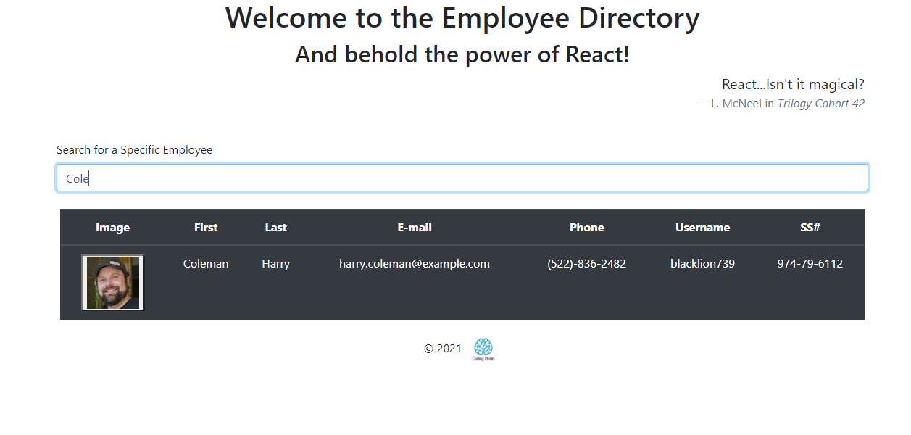
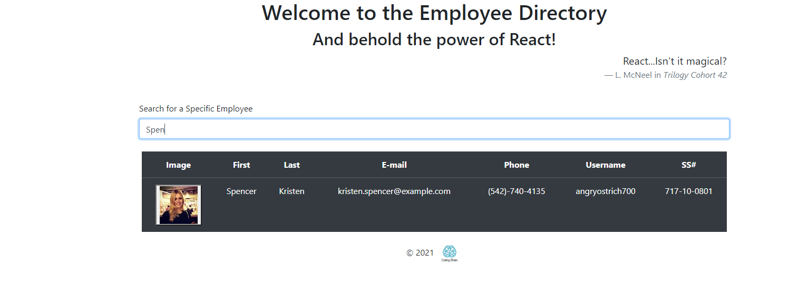

# Employee Tracker - React!

## Deployed site Links:

[Netlify](https://vigorous-colden-5d798f.netlify.app/)  
[Github Profile](https://github.com/nguenang7)

  ## Description 
  * This project is designed to search and filtr through a list of employees
  
  ## Tabel of contents

> * [Title / Repository Name]
>   * [About](#about)
>   * [Table of contents](#tabel-of-contents)
>   * [Installation](#installation)
>   * [Usage](#usage)
>   * [Screenshots](#sceenshots)
>   * [Resources (Documentation and other links)](#resources)
>   * [Contributers](#contributers)
>   * [License](#license)
>   * [Tests](#tests)
>   * [Questions](#questions)

## Instalation

N/A

## Usage

 Through the deployed on the browser

## Screen shots

## Resources

## Contributers
Contributers for this project were:

- Gregory Nguenang

## Tests

N/A

## Questions?
Please contact me via email for any further question.

## Contact
reach me at njethur@gmail.com
